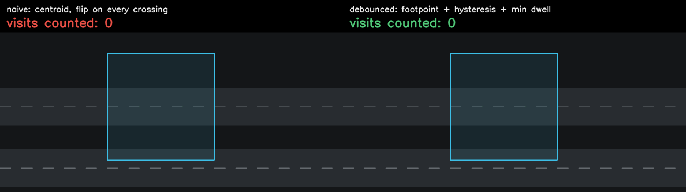
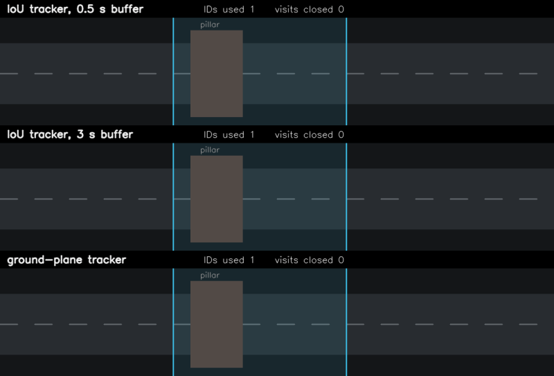
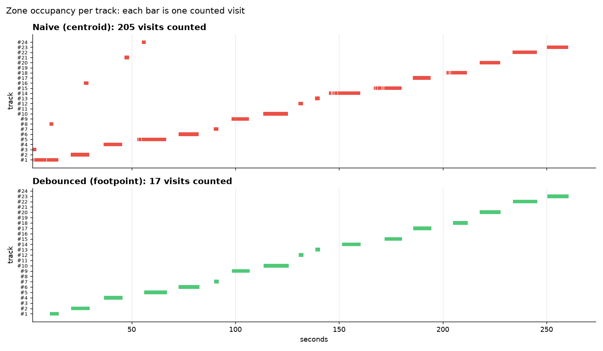
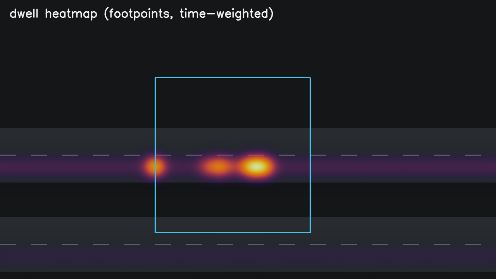
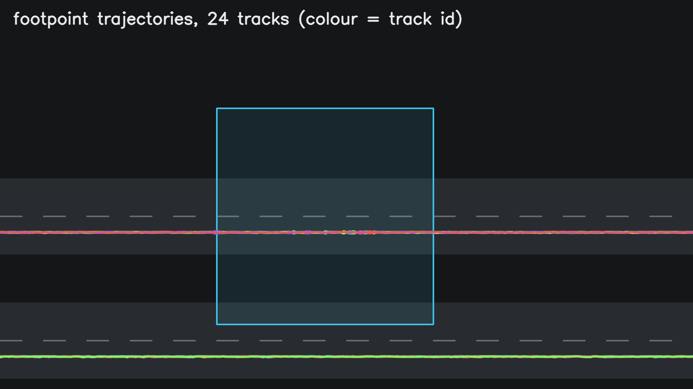
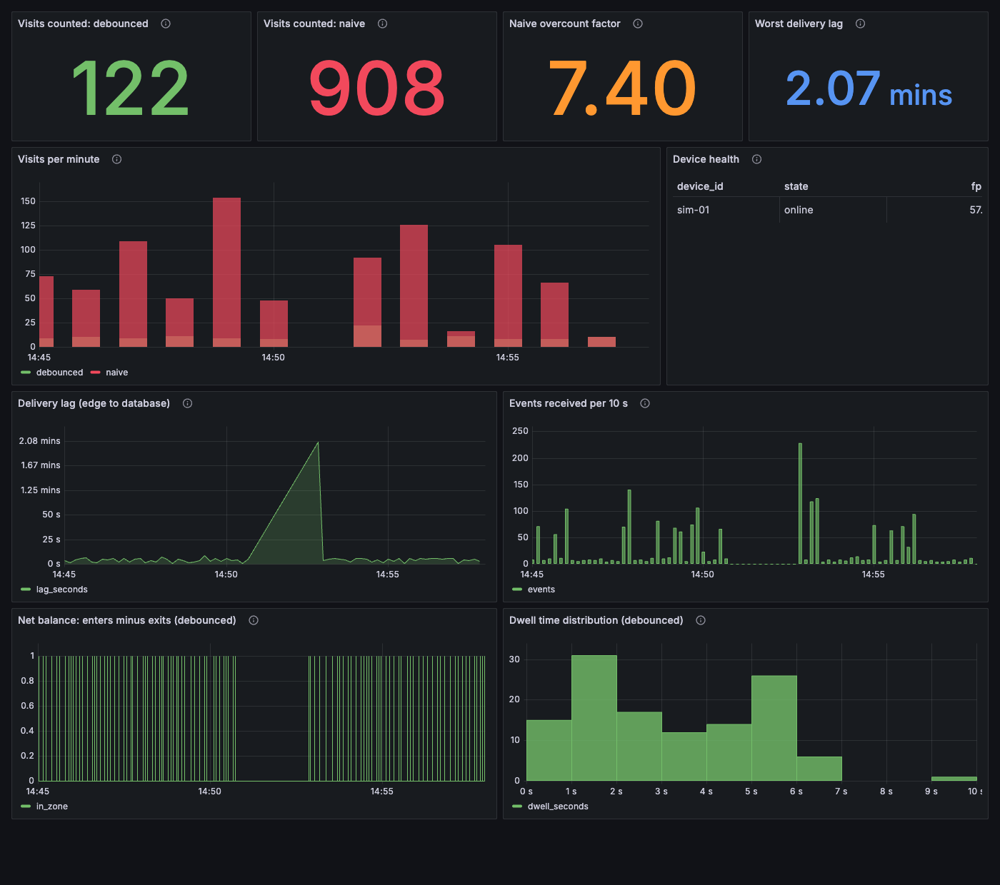

# edge-cv-lab

**A virtual edge computer-vision lab: reproduce and fix real-world video analytics failures with no cameras, no edge boxes and no GPU.**

Video analytics systems (drive-thru timing, traffic counting, footfall) tend to fail in the same few ways: objects get counted many times when they idle on a zone boundary, shadows drag boxes into the wrong lane, and events vanish when the uplink drops. These are usually debugged on site, on real hardware, slowly.

This repo shows they can be reproduced, measured and fixed on a laptop:

| Piece | What it is | Needs |
|---|---|---|
| [`harness/`](harness) | Offline replay harness. Saved tracks in, zone events out. Every failure mode is a deterministic test. | Python only |
| [`docker-compose.yml`](docker-compose.yml) | The lab: looping RTSP "camera" → detector + tracker → throttled uplink → MQTT → Postgres | Docker |
| [`chaos/`](chaos) | One-line network impairment: 64–512 kbps uplinks, latency, outages | Docker |
| [`grafana/`](grafana) | Provisioned live dashboard: naive vs debounced counts, delivery lag, device health, dwell times | Docker |
| [`harness/replay/trackers/`](harness/replay/trackers) | Pluggable trackers on identical saved detections, plus a MOTChallenge bridge for any research repo. See [docs/trackers.md](docs/trackers.md) | Python |
| [`tools/label.html`](tools/label.html) | Single-file ground-truth labeller: draw a zone, tap keys while the clip plays, export JSON | A browser |
| [`harness/replay/viz.py`](harness/replay/viz.py) | Comparison GIF, dwell heatmap, trajectories, per-track timeline | Python |

The same zone logic module runs in both, so what passes offline is what ships to the simulated edge node.





Same detections, three trackers. The middle one hands each new car the previous car's ID, so six customers become one visit with a dwell timer that never resets. Details in [docs/trackers.md](docs/trackers.md).

## How the hardware is simulated

| Real thing | Stand-in | Fidelity |
|---|---|---|
| IP camera | A video file looped forever by ffmpeg into MediaMTX, served as `rtsp://`. The edge node cannot tell it from a real camera. | High for pipeline behaviour. Footage is whatever you supply. |
| Camera + model, when you have no footage | `sim` service: seeded synthetic vehicles with known ground truth, replayed in real time | Exact ground truth, schematic scene |
| Edge box | A memory-capped container running detector, tracker and zone logic | Pipeline and failure behaviour. Not NPU numerics or speed. |
| Cellular uplink | Toxiproxy between edge and broker: bandwidth caps, latency, outages | TCP level |
| Cloud | EMQX, Postgres, Grafana in containers | Same software, single node |

## Headline result

One synthetic car idles on a zone boundary for 10 seconds with ±6 px box jitter, then drives through. Ground truth: **1 visit**.

| Counter | Enter events | Error |
|---|---|---|
| Naive (centroid, flip on every crossing) | 66 | +6500% |
| Debounced state machine (footpoint + hysteresis + min dwell) | **1** | **0%** |

Reproduce: `cd harness && python -m replay.cli --tracks fixtures/boundary_jitter.jsonl --zone fixtures/zone.json --expected 1`

The 24-vehicle traffic fixture (ground truth 17 visits) gives 205 naive vs 17 debounced (`cd harness && python -m replay.cli --tracks fixtures/traffic.jsonl --zone fixtures/zone.json --expected 17`). Lane B never enters the zone, yet shadow-stretched boxes make the naive counter log visits there:



| Dwell heatmap | Trajectories |
|---|---|
|  |  |

Every image is generated from checked-in fixtures: `pip install -e "harness[viz]" && make visuals`. Add `--video clip.mp4` to draw over a real frame instead of the schematic road.

Full write-up with real footage: [docs/case-study-tracking.md](docs/case-study-tracking.md).

## Quick start

> **Verified so far:** CI runs the harness tests, checks fixtures regenerate byte-identical, and builds and import-checks the `sim` and `ingest` images. `make up` has been booted end to end: events reach Postgres and every Grafana panel fills. `make drill` has been run on a fresh lab: through a 64 kbps cap, 400 ms latency each way and a 2 minute outage, all 1388 events of the 5 scenes that finished arrived exactly once (naive-event delivery lag: median 0.59 s under latency, up to 122.54 s after the outage). Not yet run: `make up-video` (edge + YOLO). `make visuals` and `make trackers` are not run in CI.

**Harness (about a minute, no Docker):**

```bash
pip install -e "harness[dev]"
make test
```

**Full lab, no footage needed:**

```bash
make up              # synthetic traffic -> throttled uplink -> MQTT -> Postgres -> Grafana
make counts          # enter/exit totals per counter
```

Grafana: http://localhost:3000 (no login; admin / lab to edit). EMQX: http://localhost:18083 (admin / public).

**Full lab with real video:**

```bash
# put a fixed-camera traffic clip at media/sample.mp4 (see media/README.md)
make up-video        # RTSP loop -> YOLO + ByteTrack on CPU -> same pipeline
```

**Your own clip, end to end:**

```bash
open tools/label.html          # any browser: draw the zone, tap E/X while watching at 2x, save zone.json + truth.json
pip install -e "harness[video]"
cd harness
python scripts/dump_tracks.py --video ../media/clip.mp4 --tracker bytetrack.yaml --out runs/bytetrack.jsonl
python -m replay.score --tracks runs/bytetrack.jsonl --zone zone.json --truth truth.json
```

`score` matches each predicted visit to a labelled one in time, so a miss and a double count cannot cancel out. Log every clip in [media/SOURCES.md](media/SOURCES.md).

**Break the network:**

```bash
chaos/scenarios.sh 64k        # 64 kbps uplink
chaos/scenarios.sh outage 120 # 2 minute disconnect
chaos/scenarios.sh reset
make delivery                 # did every event arrive exactly once? each finished scene vs its offline replay
make drill                    # all of it on a fresh lab, ~9 min, with a delivery-lag table per phase
# Grafana: events flatline, then a catch-up spike with high delivery lag
```

<!-- Screenshot, not generated by make: `make up`, then chaos/scenarios.sh 64k, latency, outage 120 (reset between),
     dashboard captured headless at 1400x1240 in kiosk mode over that window. Replace it by re-running the same sequence. -->


## Failure modes covered

| Failure | Cause | Fix demonstrated | Fixture |
|---|---|---|---|
| Track vanishes inside the zone, visit never ends | Counter only reacts to boxes it receives | `lost_ms` timeout closes the visit at the last-seen time | `queue.dets.jsonl` |
| Boundary jitter inflates counts | State flips on every frame the anchor crosses the edge | N-frame and spatial hysteresis, minimum dwell, cooldown | `boundary_jitter.jsonl` |
| Shadow pulls box into adjacent lane | Centroid moves when the box stretches | Bottom-centre footpoint anchor | `shadow_expansion.jsonl` |
| Events lost on disconnect | Fire-and-forget publish | QoS 1, persistent session, bounded local queue | lab + `outage` |
| Double counting after reconnect | At-least-once redelivery | ULID `event_id` + `ON CONFLICT DO NOTHING` | lab + `outage` |
| Next car inherits the previous car's ID, merging visits | IoU association plus a track left parked where a vehicle vanished | Ground-contact association with a lane-shaped gate and damped coasting | `queue.dets.jsonl` |
| "Online" device that is actually dead | Health inferred from network reachability | App-level heartbeat with FPS, plus MQTT last-will | lab |

Roadmap: published trackers (FastTracker, UCMCTrack, TrackTrack) on real footage through the MOT bridge, scored with TrackEval; phantom boxes between parallel vehicles, entry/exit net-balance reconciliation, broker drain test on kind + EMQX Operator.

## Design notes

- **Tracks, not video, are the test input.** Detection and tracking run once; zone logic then replays in milliseconds. This is what makes a regression suite practical.
- **Integer millisecond timestamps, one ULID per event.** Float timestamps and timestamp-derived filenames break exact matching between services.
- **Fail loud.** A malformed record raises with file and line number. Nothing is skipped silently.
- **Fixtures are generated, seeded and checked in CI**, so results are reproducible by anyone.

More in [docs/architecture.md](docs/architecture.md).

## Limitations

- Synthetic fixtures exercise the logic and reproduce specific failure modes; they say nothing about real-world accuracy. The case study uses public footage for that.
- The edge node runs YOLO on CPU. It models pipeline behaviour, not accelerator (NPU) numerics or latency.
- Toxiproxy shapes TCP only. It does not model packet loss or radio behaviour of a real cellular link.
- The `sim` scene hands the counter perfect track IDs, so it tests zone logic, not tracking. Tracker comparisons run on the queue fixture's raw detections instead.
- For `make up-video`, tune `mem_limit` and the zone polygon for your clip.

## Licence

MIT. Footage and datasets keep their own licences.
