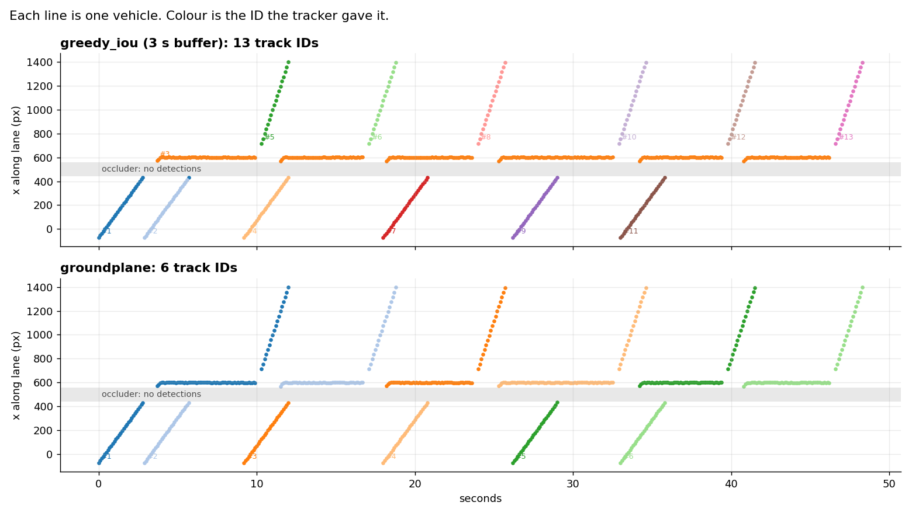

# Comparing trackers

The detector runs once and saves boxes with no identity. Every tracker then sees exactly the same
input, and the zone logic and scoring downstream are identical. Only the tracker changes.

```
video --dump_detections--> dets.jsonl --tracker--> tracks.jsonl --zones + score--> one table row
```

## Result on the queue fixture

Six cars queue, pass behind a pillar (no detections), stop at a service window, and pull away hard
enough that motion blur drops three frames of detections. 10 fps.

| tracker | visits found (of 6) | id switches | id transfers | IDs used |
|---|---|---|---|---|
| greedy_iou, 0.5 s buffer | 6 | 12 | 0 | 18 |
| greedy_iou, 3 s buffer | 1 | 13 | 6 | 13 |
| greedy_iou, 10 s buffer | 1 | 42 | 35 | 13 |
| groundplane | **6** | **0** | **0** | **6** |


Grey shapes are the real vehicles, drawn even behind the pillar where the detector sees nothing.
Coloured boxes are what each tracker reports. Watch the dwell timer in the middle strip: it never resets.



Reading it: with a 3 s buffer the first car's track stays parked at the window after it leaves, and
every following car inherits that ID (the long orange line). Six customers become one long visit.
Shortening the buffer fixes the count but shatters each car into three IDs, so queue-to-exit time can
no longer be measured. It also only works because the zone counter closes a visit when its track goes
silent for 3 s (`lost_ms`). Without that timeout those visits would stay open forever. Associating on the ground contact point with a lane-shaped gate gets both right.

Reproduce: `make trackers`.

**What this does and does not show.** The fixture is synthetic and was written to reproduce one
specific failure. It proves the mechanism and guards against regressions. It says nothing about
accuracy on real footage, where detections are noisier and vehicles overlap. `groundplane` is a
teaching implementation of published ideas, not a benchmark-grade tracker.

## Adding a tracker

**Pure Python.** Copy `harness/replay/trackers/greedy_iou.py`. Implement
`update(frame, ts_ms, dets) -> list[TrackBox]`, decorate the class with `@register("name")`, and import
it in `trackers/__init__.py::_load`. `update` is called for every frame in order, including empty ones.

**A Python package.** See `boxmot_adapter.py`, which exposes `boxmot_bytetrack` and `boxmot_ocsort`.
It is not exercised in CI because boxmot depends on torch. Appearance-based trackers need real frames,
so they cannot run from a detections file alone.

**Any research repo, no adapter code.** Most tracking papers read and write MOTChallenge text files:

```bash
cd harness
python -m replay.motformat export-dets --dets runs/dets.jsonl --out seq/det/det.txt
#   ... run the authors' code on seq/ following their README ...
python -m replay.motformat import-tracks --mot their_output.txt --dets runs/dets.jsonl --out runs/theirs.jsonl
python -m replay.compare --dets runs/dets.jsonl --zone zone.json --truth truth.json \
    --trackers greedy_iou groundplane --tracks theirs=runs/theirs.jsonl
```

Candidates worth running this way:

| Tracker | Why it is relevant | Code |
|---|---|---|
| FastTracker (arXiv:2508.14370) | Built for vehicles in traffic; occlusion handling without appearance features; lane and road-boundary priors | github.com/Hamidreza-Hashempoor/FastTracker |
| UCMCTrack (AAAI 2024, arXiv:2312.08952) | Kalman filter and association on the ground plane; motion only, CPU-fast. Needs camera parameters per scene | github.com/corfyi/UCMCTrack |
| TrackTrack (CVPR 2025) | Track-aware initialisation suppresses duplicate tracks on overlapping detections | github.com/kamkyu94/TrackTrack |
| SAM2MOT (arXiv:2504.04519) | Mask-based, zero-shot. Too heavy for the edge; useful offline for generating ground truth | github.com/TripleJoy/SAM2MOT |

Check each repository's licence before depending on it, and record what you ran in the case study.

## Metrics

`id_switches` and `id_transfers` in `replay/idmetrics.py` are small and unit-testable. For numbers
you intend to publish, export with `replay.motformat export-tracks` and use TrackEval (HOTA, IDF1).
